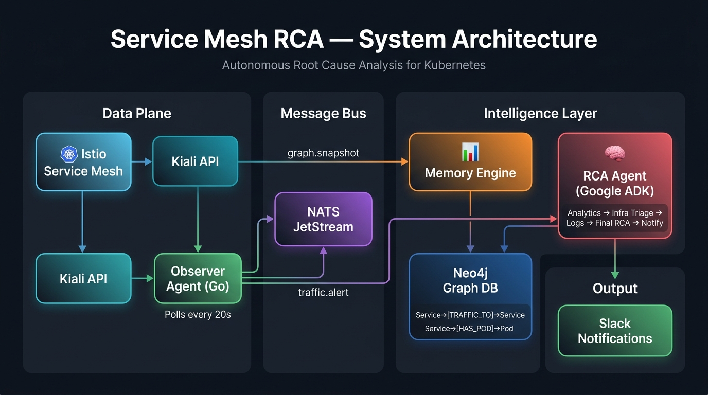
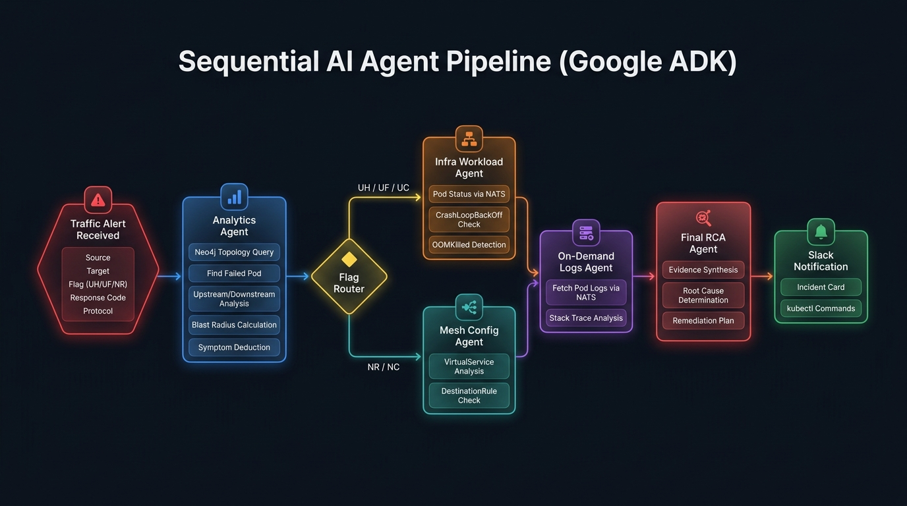
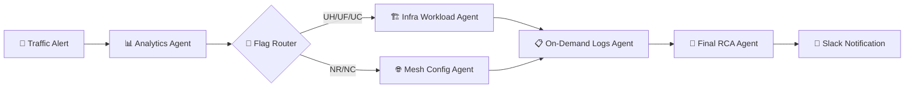

<p align="center">
  
</p>

<h1 align="center">🛡️ Service Mesh RCA — Autonomous Root Cause Analysis</h1>

<p align="center">
  <strong>AI-powered incident detection and root cause analysis for Kubernetes service meshes</strong>
</p>

<p align="center">
  <a href="#-architecture"></a>
  <a href="#-quick-start"></a>
  <a href="#-tech-stack"></a>
  <a href="#-related-repositories"></a>
  <a href="https://github.com/TechNinjaAyush/Service-Mesh"></a>
</p>

<p align="center">
  <em>Reduced incident response time from <strong>~60 minutes</strong> of manual debugging to <strong>~25 minutes</strong> of automated investigation → just read the Slack alert and run the suggested kubectl command.</em>
</p>

---

## 📋 Table of Contents

- [Overview](#-overview)
- [The Problem](#-the-problem)
- [How It Works](#-how-it-works)
- [Architecture](#-architecture)
- [RCA Agent Pipeline](#-rca-agent-pipeline)
- [Tech Stack](#-tech-stack)
- [Related Repositories](#-related-repositories)
- [Project Structure](#-project-structure)
- [Prerequisites](#-prerequisites)
- [Quick Start](#-quick-start)
- [Environment Variables](#-environment-variables)
- [NATS Subjects](#-nats-subjects)
- [Neo4j Graph Schema](#-neo4j-graph-schema)
- [Istio Flags Detected](#-istio-flags-detected)
- [Traffic Alert Schema](#-traffic-alert-schema)
- [Slack Alert Output](#-slack-alert-output)
- [CI/CD](#-cicd)
- [Contributing](#-contributing)

---

## 🔭 Overview

**Service Mesh RCA** is an event-driven, AI-powered system that **autonomously detects, investigates, and diagnoses** failures in Kubernetes service mesh environments. It continuously observes your Istio service mesh through Kiali, builds a live topology graph in Neo4j, detects traffic anomalies (like `UH`, `UF`, `NR` flags), and triggers a sequential AI agent pipeline built on [Google ADK](https://google.github.io/adk-docs/) that performs root cause analysis — delivering a full incident report with remediation commands directly to Slack.

**No dashboards to watch. No logs to grep. Just read the Slack alert and run the command.**

---

## 🔥 The Problem

When a service fails in a Kubernetes mesh:

| Without RCA System | With RCA System |
|---|---|
| ⏱️ ~60 min manual investigation | ⚡ ~25 min automated analysis |
| 🔍 Manually check Kiali dashboard | 🤖 Auto-detects Istio failure flags |
| 📋 Grep through pod logs | 📊 AI agent fetches & analyzes logs |
| 🧩 Trace upstream/downstream manually | 🌐 Neo4j graph topology auto-queried |
| 🤔 Guess root cause from experience | 🧠 Sequential AI agents deduce root cause |
| 💬 Manually write incident report | 📬 Rich Slack incident card with `kubectl` fix |

---

## ⚙️ How It Works

```
┌──────────────────────────────────────────────────────────────────┐
│                        CONTINUOUS LOOP (every 20s)               │
│                                                                  │
│   Istio Mesh ──► Kiali API ──► Observer Agent (this repo)        │
│                                      │                           │
│                          ┌───────────┴────────────┐              │
│                          ▼                        ▼              │
│                   graph.snapshot            traffic.alert         │
│                     (NATS JS)                (NATS JS)           │
│                          │                        │              │
│                          ▼                        ▼              │
│                   Memory Engine            RCA Agent (ADK)       │
│                          │                        │              │
│                          ▼                        │              │
│                   Neo4j Graph DB ◄────────────────┘              │
│                                                   │              │
│                                                   ▼              │
│                                            Slack Alert 🔔        │
└──────────────────────────────────────────────────────────────────┘
```

**Step-by-step flow:**

1. **Observer Agent** (this repo) polls the **Kiali API** every 20 seconds to fetch the latest service mesh graph
2. The graph (with pod metadata from the Kubernetes API) is published to **NATS JetStream** on subject `graph.snapshot`
3. The Observer also analyzes edges for **Istio failure flags** (`UH`, `UF`, `NR`) — when detected, a `TrafficAlert` is published to `traffic.alert`
4. The **Memory Engine** subscribes to `graph.snapshot` and stores the topology in **Neo4j** with relationships: `Service -[TRAFFIC_TO]→ Service` and `Service -[HAS_POD]→ Pod`
5. The **RCA Agent** (Google ADK) subscribes to `traffic.alert` and kicks off a sequential AI pipeline:
   - **Analytics Agent** → queries Neo4j for topology, blast radius, symptoms
   - **Flag Router** → routes to specialized agent based on the Istio flag
   - **Infra Workload Agent** → checks pod status via NATS request/reply
   - **On-Demand Logs Agent** → fetches pod logs via NATS request/reply
   - **Final RCA Agent** → synthesizes all findings into a root cause report
   - **Notification** → posts incident card to **Slack**

---

## 🏗️ Architecture

<p align="center">
  
</p>

The system is composed of **4 microservices** and **2 databases**, connected through NATS JetStream as the central event bus:

| Component | Role | Technology |
|---|---|---|
| **Observer Agent** _(this repo)_ | Polls Kiali, enriches graph with pod data, detects anomalies, publishes events | Go, Gin, K8s client-go |
| **NATS JetStream** | Durable message bus for graph snapshots and traffic alerts | NATS with JetStream persistence |
| **Memory Engine** | Subscribes to graph snapshots, builds/updates Neo4j topology | Node.js / Go |
| **Neo4j** | Graph database storing service topology and pod relationships | Neo4j 5.x |
| **RCA Agent** | Sequential AI agent pipeline for root cause analysis | Python, Google ADK (Gemini) |
| **Slack** | Incident notification delivery | Slack Webhooks |

---

## 🧠 RCA Agent Pipeline

<p align="center">
  
</p>

The RCA Agent is a **sequential workflow** built with [Google Agent Development Kit (ADK)](https://google.github.io/adk-docs/) that orchestrates 5 specialized sub-agents:

### Agent Flow



### Agent Details

| Agent | Trigger | What It Does | Tools |
|---|---|---|---|
| **Analytics Agent** | Every traffic alert | Queries Neo4j to find the failed pod, upstream/downstream services, blast radius, and deduces symptoms from the alert metadata | `read_neo4j_cypher`, `get_current_time` |
| **Infra Workload Agent** | Flags: `UH`, `UF`, `UC` | Checks pod status via NATS request/reply to the Observer, detects CrashLoopBackOff, OOMKilled, scheduling failures | `check_pod_status_via_nats` |
| **Mesh Config Agent** | Flags: `NR`, `NC` | Analyzes Istio VirtualServices, DestinationRules, and K8s Service configurations for routing misconfigurations | — |
| **On-Demand Logs Agent** | After triage agent | Fetches container logs via NATS request/reply, analyzes for stack traces and application errors | `fetch_pod_logs_via_nats` |
| **Final RCA Agent** | After all data gathered | Synthesizes all findings from prior agents into a cohesive root cause analysis with remediation plan | — |
| **Notification Action** | After RCA complete | Deterministically posts a rich incident card to Slack with severity, blast radius, and `kubectl` command | `send_slack_incident_alert` |

### NATS Request/Reply Pattern

The Observer Agent (this repo) also acts as a **Kubernetes API bridge** via NATS request/reply:

```
RCA Agent ──► NATS "observer.pod.status" ──► Observer Agent ──► K8s API ──► Response
RCA Agent ──► NATS "observer.pod.logs"   ──► Observer Agent ──► K8s API ──► Response
```

This allows the RCA Agent (running in Python) to query Kubernetes pod status and logs **without needing direct cluster access**.

---

## 🛠️ Tech Stack

| Layer | Technology | Purpose |
|---|---|---|
| **Language** | Go 1.25 | Observer Agent core |
| **Web Framework** | Gin | HTTP server & health endpoints |
| **Messaging** | NATS + JetStream | Event-driven communication |
| **Graph Database** | Neo4j | Service topology storage |
| **Container Runtime** | Docker + Distroless | Minimal, secure container images |
| **Kubernetes** | client-go | Pod status, logs, events API |
| **Service Mesh** | Istio | Traffic management & mTLS |
| **Observability** | Kiali API | Service mesh visualization & graph |
| **AI Framework** | Google ADK (Python) | Sequential agent orchestration |
| **AI Model** | Google Gemini | LLM for root cause reasoning |
| **Notifications** | Slack Webhooks | Incident alerting |
| **CI/CD** | GitHub Actions | Build, scan (Trivy), push to GAR |

---

## 🔗 Related Repositories

This project is composed of **3 repositories** that work together:

| Repository | Description | Tech |
|---|---|---|
| **[Service-Mesh](https://github.com/TechNinjaAyush/Service-Mesh)** _(this repo)_ | Observer Agent — polls Kiali, publishes graph snapshots & traffic alerts to NATS, serves as K8s API bridge | Go |
| **[golang-memory-engine](https://github.com/TechNinjaAyush/golang-memory-engine)** | Subscribes to `graph.snapshot` via NATS, builds and maintains the service topology graph in Neo4j | Go |
| **[RCA-pipeline](https://github.com/TechNinjaAyush/RCA-pipeline)** | Sequential AI agent pipeline (Google ADK) — consumes `traffic.alert`, queries Neo4j, investigates pods, produces RCA report, sends Slack notification | Python |

---

## 📁 Project Structure

```
Service-Mesh/
├── cmd/
│   └── server/
│       ├── main.go              # Entry point — HTTP server, NATS connection, JetStream setup
│       └── main_test.go         # Server tests
├── istio/
│   ├── istio.go                 # Core logic — Kiali polling, graph publishing, alert detection,
│   │                            #   pod status observer, pod logs observer
│   └── istio_test.go            # Istio handler tests
├── model/
│   └── graph.go                 # Data models — GraphResponse, TrafficAlert, PodAlert, etc.
├── docs/
│   └── images/                  # Architecture & pipeline diagrams
├── .github/
│   └── workflows/
│       └── ci.yml               # CI pipeline — build, Trivy scan, push to GCP Artifact Registry
├── Dockerfile                   # Multi-stage build (Go 1.25 → Distroless)
├── rca-agent.yaml               # Docker Compose — all services (observer, NATS, Neo4j, memory engine, RCA agent)
├── .env.example                 # Environment template
├── go.mod                       # Go module dependencies
└── go.sum                       # Dependency checksums
```

---

## 📦 Prerequisites

Before running the project, make sure you have:

| Requirement | Version | Purpose |
|---|---|---|
| **Docker** & **Docker Compose** | v20+ / v2+ | Run all services |
| **Kubernetes Cluster** | v1.28+ | Running your microservices with Istio |
| **Istio** | v1.20+ | Service mesh with mTLS and traffic management |
| **Kiali** | v1.70+ | Istio observability dashboard (provides the graph API) |
| **kubectl** | v1.28+ | Cluster access (mounted into observer container) |
| **Go** | v1.25+ | _(only if building locally)_ |
| **Slack Webhook URL** | — | For receiving incident notifications |
| **Google API Key** | — | For Gemini LLM access in RCA Agent |

### Kubernetes Cluster Setup (KinD)

> [!CAUTION]
> **Istio is mandatory.** Without Istio installed in your cluster, the Kiali API will have no data and the entire RCA pipeline will not function. NATS is also required as the central message bus.

#### Step 1 — Create a KinD Cluster

```bash
# Install KinD if not already installed
# https://kind.sigs.k8s.io/docs/user/quick-start/#installation
go install sigs.k8s.io/kind@latest

# Create a cluster (use a config for extra ports if needed)
cat <<EOF | kind create cluster --name rca-mesh --config=-
kind: Cluster
apiVersion: kind.x-k8s.io/v1alpha4
nodes:
  - role: control-plane
    extraPortMappings:
      - containerPort: 30000
        hostPort: 30000
        protocol: TCP
  - role: worker
  - role: worker
EOF

# Verify the cluster is running
kubectl cluster-info --context kind-rca-mesh
```

#### Step 2 — Install Istio

```bash
# Download and install istioctl
curl -L https://istio.io/downloadIstio | ISTIO_VERSION=1.24.0 sh -
cd istio-1.24.0
export PATH=$PWD/bin:$PATH

# (Optional) Add istioctl to your shell permanently
echo 'export PATH="$HOME/istio-1.24.0/bin:$PATH"' >> ~/.bashrc
source ~/.bashrc
```

Choose an Istio installation profile based on your needs:

| Profile | Components | Use Case |
|---|---|---|
| `demo` | istiod, ingress gateway, egress gateway | ✅ **Recommended for this project** — includes everything |
| `default` | istiod, ingress gateway | Production with minimal footprint |
| `minimal` | istiod only | Testing Istio control plane |

```bash
# Install Istio with the demo profile (recommended)
istioctl install --set profile=demo -y

# Verify Istio installation
istioctl verify-install

# Enable automatic sidecar injection for the default namespace
kubectl label namespace default istio-injection=enabled

# Verify all Istio components are running
kubectl get pods -n istio-system
```

Expected output — all pods should be `Running`:
```
NAME                                    READY   STATUS    RESTARTS   AGE
istio-egressgateway-xxx                 1/1     Running   0          2m
istio-ingressgateway-xxx                1/1     Running   0          2m
istiod-xxx                              1/1     Running   0          2m
```

> [!IMPORTANT]
> Wait until **all** Istio pods (`istiod`, `istio-ingressgateway`, `istio-egressgateway`) show `Running` before proceeding. Use `kubectl get pods -n istio-system -w` to watch.

#### Step 3 — Install Kiali & Observability Addons

Kiali requires **Prometheus** to function. We also recommend installing Grafana and Jaeger for full observability:

```bash
# Install all Istio addons (Prometheus, Kiali, Grafana, Jaeger)
kubectl apply -f https://raw.githubusercontent.com/istio/istio/release-1.24/samples/addons/prometheus.yaml
kubectl apply -f https://raw.githubusercontent.com/istio/istio/release-1.24/samples/addons/kiali.yaml
kubectl apply -f https://raw.githubusercontent.com/istio/istio/release-1.24/samples/addons/grafana.yaml
kubectl apply -f https://raw.githubusercontent.com/istio/istio/release-1.24/samples/addons/jaeger.yaml

# Wait for all addons to be ready
kubectl rollout status deployment/kiali -n istio-system
kubectl rollout status deployment/prometheus -n istio-system

# Port-forward Kiali to localhost:20001
kubectl port-forward svc/kiali -n istio-system 20001:20001 &
```

Verify Kiali is accessible at: **http://localhost:20001**

> [!NOTE]
> The Observer Agent in this project calls the Kiali API at `http://localhost:20001/kiali/api/namespaces/graph` to fetch the service mesh graph. Make sure port-forwarding is active or configure `BASE_URL` in `.env` accordingly.

#### Step 4 — Deploy Google Online Boutique (Microservices Demo)

This project uses [**Google Online Boutique**](https://github.com/GoogleCloudPlatform/microservices-demo) — a cloud-native, polyglot microservices application with **11 services** that generates rich inter-service traffic, perfect for observing the full mesh topology in Kiali.

```
                        ┌───────────────┐
                        │   Frontend    │
                        └──────┬────────┘
               ┌───────────────┼───────────────┐
               ▼               ▼               ▼
        ┌────────────┐  ┌────────────┐  ┌──────────────┐
        │  Ad Service │  │Cart Service│  │Product Catalog│
        └────────────┘  └─────┬──────┘  └──────────────┘
                              ▼
                       ┌────────────┐
                       │  Checkout  │
                       └──────┬─────┘
          ┌───────────────┬───┼───┬────────────────┐
          ▼               ▼   ▼   ▼                ▼
   ┌───────────┐  ┌──────────┐ ┌───────┐  ┌──────────────┐
   │  Shipping │  │ Payment  │ │ Email │  │   Currency   │
   └───────────┘  └──────────┘ └───────┘  └──────────────┘
                                    ┌──────────────────┐
                                    │ Recommendation   │
                                    └──────────────────┘
                              ┌──────────────────┐
                              │ Load Generator   │
                              └──────────────────┘
```

```bash
# Clone the Google microservices demo
git clone https://github.com/GoogleCloudPlatform/microservices-demo.git
cd microservices-demo

# Deploy all 11 microservices to the default namespace (with Istio sidecar injection)
kubectl apply -f ./release/kubernetes-manifests.yaml

# Wait for all pods to be ready (each pod should show 2/2 — app container + Istio sidecar)
kubectl get pods -w
```

Expected output — all pods should show `2/2 Running`:
```
NAME                                     READY   STATUS    RESTARTS   AGE
adservice-xxx                            2/2     Running   0          3m
cartservice-xxx                          2/2     Running   0          3m
checkoutservice-xxx                      2/2     Running   0          3m
currencyservice-xxx                      2/2     Running   0          3m
emailservice-xxx                         2/2     Running   0          3m
frontend-xxx                             2/2     Running   0          3m
loadgenerator-xxx                        2/2     Running   0          3m
paymentservice-xxx                       2/2     Running   0          3m
productcatalogservice-xxx                2/2     Running   0          3m
recommendationservice-xxx                2/2     Running   0          3m
shippingservice-xxx                      2/2     Running   0          3m
```

> [!TIP]
> The **loadgenerator** service automatically sends continuous traffic across all services, so you'll see a rich traffic graph in Kiali and meaningful data in the Observer Agent's graph snapshots within ~60 seconds of deployment.

#### Step 5 — Install NATS CLI (Optional but Recommended)

The NATS CLI is useful for debugging and monitoring messages flowing through the system:

```bash
# Install NATS CLI
# Option 1: Go install
go install github.com/nats-io/natscli/nats@latest

# Option 2: Download binary (Linux amd64)
curl -L https://github.com/nats-io/natscli/releases/latest/download/nats-0.1.5-linux-amd64.zip -o nats.zip
unzip nats.zip -d /usr/local/bin/

# Option 3: Homebrew (macOS/Linux)
brew tap nats-io/nats-tools
brew install nats-io/nats-tools/nats
```

After all services are running, you can use NATS CLI to monitor traffic:

```bash
# Subscribe to graph snapshots (see what the Observer is publishing)
nats sub graph.snapshot --server=nats://localhost:4222

# Subscribe to traffic alerts (see detected failures)
nats sub traffic.alert --server=nats://localhost:4222

# Check JetStream stream info
nats stream info GRAPH --server=nats://localhost:4222
nats stream info TRAFFIC --server=nats://localhost:4222
```

> [!NOTE]
> The NATS **server** itself is included in the Docker Compose file (`rca-agent.yaml`) — you don't need to install it separately. The NATS CLI above is only for debugging/monitoring from your host machine.

---

## 🚀 Quick Start

### 1. Clone All Repositories

```bash
# Clone the Observer Agent (this repo)
git clone https://github.com/TechNinjaAyush/Service-Mesh.git
cd Service-Mesh

# Clone the Memory Engine
git clone https://github.com/TechNinjaAyush/golang-memory-engine.git

# Clone the RCA Agent
git clone https://github.com/TechNinjaAyush/RCA-pipeline.git
```

### 2. Configure Environment

```bash
# Copy the example env file
cp .env.example .env
```

Edit `.env` with your configuration:

```env
graphType=app
namespaces=default
duration=60s
BASE_URL=http://host.docker.internal:20001/kiali/api/namespaces/graph
NATS_URL=nats://nats:4222
```

### 3. Build Docker Images

```bash
# Build the Observer Agent
docker build -t service-mesh-new:v1.2.3 .

# Build the Memory Engine (from its repo)
cd ../golang-memory-engine
docker build -t memory-engine:v1.1.4 .

# Build the RCA Agent (from its repo)
cd ../RCA-pipeline
docker build -t rca-agent:v1.2.3 .
```

### 4. Create the Docker Network

```bash
# If using KinD (Kind in Docker)
docker network create kind 2>/dev/null || true
```

### 5. Update Secrets in Compose File

Edit `rca-agent.yaml` and replace the placeholder values:

```yaml
# In the rca-agent service:
environment:
  GOOGLE_API_KEY: "your-actual-google-api-key"
  SLACK_WEBHOOK_URL: "https://hooks.slack.com/services/YOUR/WEBHOOK/URL"

# In the neo4j service:
environment:
  NEO4J_AUTH: neo4j/your-secure-password

# In the memory-engine service:
environment:
  NEO4J_PASSWORD: "your-secure-password"
```

### 6. Launch All Services

```bash
docker compose -f rca-agent.yaml up -d
```

### 7. Verify Everything Is Running

```bash
# Check all containers
docker compose -f rca-agent.yaml ps

# Check Observer Agent health
curl http://localhost:8080/health

# Check NATS server
curl http://localhost:8222/varz

# Check Neo4j browser
# Open http://localhost:7474 in your browser
```

### 8. Watch the Logs

```bash
# Observer Agent logs (see Kiali polling & alert detection)
docker logs -f service-mesh-new

# RCA Agent logs (see AI pipeline execution)
docker logs -f rca-agent

# Memory Engine logs (see graph snapshots being stored)
docker logs -f memory-engine-new
```

---

## 🔐 Environment Variables

### Observer Agent (this repo)

| Variable | Description | Default |
|---|---|---|
| `BASE_URL` | Kiali API graph endpoint | `http://localhost:20001/kiali/api/namespaces/graph` |
| `namespaces` | Kubernetes namespaces to monitor | `default` |
| `graphType` | Kiali graph type (`app`, `workload`, `service`) | `app` |
| `duration` | Time window for Kiali metrics | `60s` |
| `NATS_URL` | NATS server connection URL | `nats://localhost:4222` |

### RCA Agent

| Variable | Description |
|---|---|
| `GOOGLE_API_KEY` | Google Gemini API key for LLM reasoning |
| `NATS_URL` | NATS server URL |
| `NEO4J_URI` | Neo4j Bolt protocol URI |
| `NEO4J_USER` | Neo4j username |
| `NEO4J_PASSWORD` | Neo4j password |
| `NATS_SUBJECT` | NATS subject to subscribe (`traffic.alert`) |
| `SLACK_WEBHOOK_URL` | Slack incoming webhook URL |

### Memory Engine

| Variable | Description |
|---|---|
| `NEO4J_URI` | Neo4j Bolt protocol URI |
| `NEO4J_USERNAME` | Neo4j username |
| `NEO4J_PASSWORD` | Neo4j password |
| `NATS_URL` | NATS server URL |

---

## 📡 NATS Subjects

| Subject | Publisher | Consumer | Payload | Persistence |
|---|---|---|---|---|
| `graph.snapshot` | Observer Agent | Memory Engine | Full Kiali graph JSON with pod metadata | JetStream (WorkQueue) |
| `traffic.alert` | Observer Agent | RCA Agent | `TrafficAlert` JSON | JetStream (WorkQueue) |
| `observer.pod.status` | RCA Agent (request) | Observer Agent (reply) | Pod status with container details, events, service match | Core NATS (Request/Reply) |
| `observer.pod.logs` | RCA Agent (request) | Observer Agent (reply) | Container logs (last 50 lines per container) | Core NATS (Request/Reply) |

---

## 🗄️ Neo4j Graph Schema

The Memory Engine stores the service mesh topology with two relationship types:

```cypher
-- Service-to-Service traffic relationship
(s1:Service {app: "frontend"})-[:TRAFFIC_TO]->(s2:Service {app: "backend"})

-- Service-to-Pod ownership relationship
(s:Service {app: "frontend"})-[:HAS_POD]->(p:Pod {name: "frontend-849f6b48f8-v6j2q"})
```

### Example Queries

```cypher
-- Find all pods for a failed service
MATCH (s:Service)-[:HAS_POD]->(p:Pod)
WHERE s.app = "frontend"
RETURN p.name AS failed_pod LIMIT 1

-- Find upstream/downstream services and blast radius
MATCH (failed:Service)
WHERE failed.app = "frontend"
OPTIONAL MATCH (up:Service)-[:TRAFFIC_TO]->(failed)
WITH failed, collect(DISTINCT up.app) AS upstream_services
OPTIONAL MATCH (failed)-[:TRAFFIC_TO]->(down:Service)
RETURN
    upstream_services,
    collect(DISTINCT down.app) AS downstream_services,
    CASE WHEN size(upstream_services) > 0 THEN size(upstream_services) ELSE 1 END AS blast_radius
```

---

## 🚩 Istio Flags Detected

The Observer Agent monitors Kiali edge traffic for these Istio response flags:

| Flag | Meaning | Routed To |
|---|---|---|
| `UH` | **No healthy upstream** — all upstream hosts are unhealthy | Infra Workload Agent |
| `UF` | **Upstream connection failure** — connection to upstream failed | Infra Workload Agent |
| `UC` | **Upstream connection termination** — connection was terminated | Infra Workload Agent |
| `NR` | **No route configured** — no matching route found | Mesh Config Agent |
| `NC` | **No cluster found** — cluster lookup failed | Mesh Config Agent |

---

## 📨 Traffic Alert Schema

When a failure flag is detected, the Observer publishes this structure to `traffic.alert`:

```json
{
  "incidentId": "550e8400-e29b-41d4-a716-446655440000",
  "source": "frontend",
  "target": "backend",
  "responseCode": "503",
  "flag": "UH",
  "host": "backend",
  "protocol": "http",
  "responseTime": "245ms",
  "rates": {
    "http": "0.50",
    "httpPercentErr": "100.00"
  },
  "flagPercent": "100.00",
  "isMTLS": "true",
  "message": "Traffic failure detected from frontend to backend (Host: backend) with protocol http, flag UH (100.00%), code 503",
  "timestamp": 1722950824
}
```

---

## 🔔 Slack Alert Output

The final RCA report is posted to Slack as a rich incident card containing:

- 🆔 **Incident ID** — unique UUID
- 🔴 **Severity** — critical / high / medium (based on blast radius)
- 💥 **Failed Service & Pod** — exact pod name
- 🔍 **Root Cause** — AI-deduced root cause
- 📊 **Diagnosis Summary** — detailed analysis
- 🌐 **Impacted Services** — upstream/downstream dependencies
- 💣 **Blast Radius** — number of affected services
- 🛠️ **Remediation** — ready-to-run `kubectl` command

**Example:**
```
kubectl rollout restart deployment frontend -n default
```
or for scaled-to-zero scenarios:
```
kubectl scale deployment frontend --replicas=1 -n default
```

---

## 🔄 CI/CD

The project uses **GitHub Actions** for continuous integration:

```yaml
# .github/workflows/ci.yml
Trigger: Push to main / Manual dispatch

Pipeline:
  1. Checkout repository
  2. Authenticate to Google Cloud (Workload Identity Federation)
  3. Setup gcloud SDK
  4. Configure Docker for GCP Artifact Registry
  5. Build Docker image (multi-stage, distroless)
  6. Scan with Trivy (CRITICAL + HIGH vulnerabilities)
  7. Push to Google Artifact Registry
```

### Required GitHub Secrets

| Secret | Description |
|---|---|
| `GCP_PROJECT_ID` | Google Cloud project ID |
| `GCP_REGION` | GCP region for Artifact Registry |
| `GAR_REPOSITORY` | Artifact Registry repository name |
| `WORKLOAD_IDENTITY_PROVIDER` | GCP Workload Identity provider |
| `SERVICE_ACCOUNT` | GCP service account email |

---

## 🤝 Contributing

Contributions are welcome! Here's how to get started:

1. **Fork** the repository
2. Create a **feature branch** (`git checkout -b feature/amazing-feature`)
3. **Commit** your changes (`git commit -m 'Add amazing feature'`)
4. **Push** to the branch (`git push origin feature/amazing-feature`)
5. Open a **Pull Request**

### Local Development

```bash
# Run locally (requires NATS and Kiali running)
go run ./cmd/server

# Run tests
go test ./...

# Build binary
go build -o graph-publisher ./cmd/server
```

---

<p align="center">
  <strong>Built with ❤️ for SRE teams who are tired of 3 AM debugging sessions</strong>
</p>

<p align="center">
  <a href="https://github.com/TechNinjaAyush/Service-Mesh">⭐ Star this repo</a> •
  <a href="https://github.com/TechNinjaAyush/Service-Mesh/issues">🐛 Report Bug</a> •
  <a href="https://github.com/TechNinjaAyush/Service-Mesh/issues">💡 Request Feature</a>
</p>
